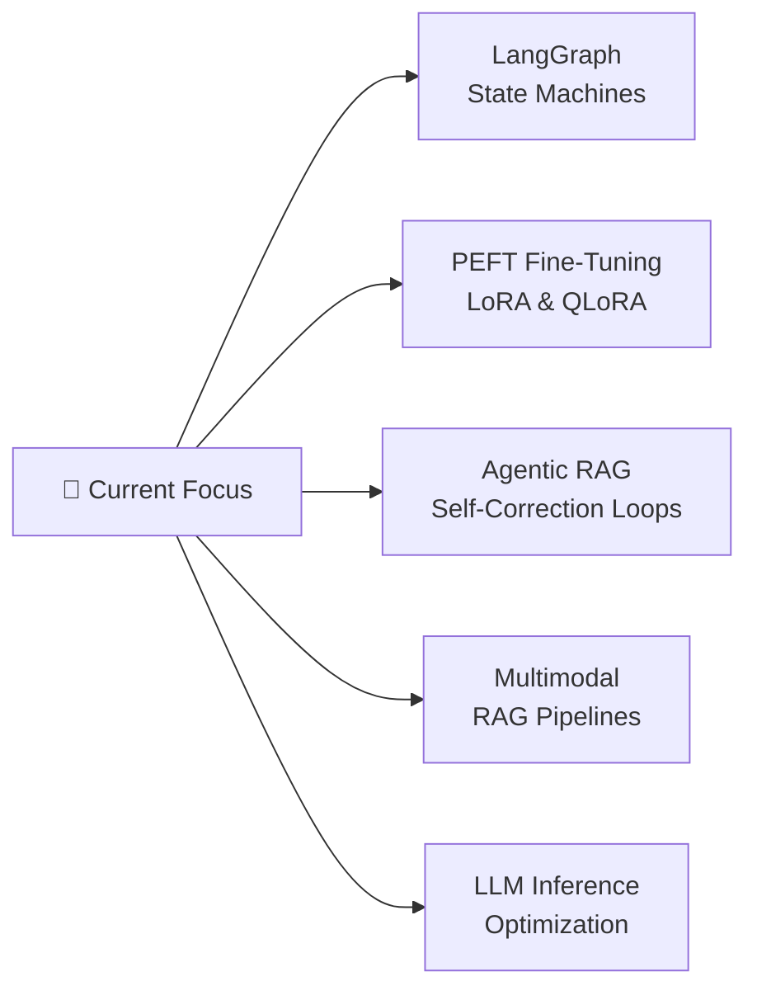

<div align="center">

<!-- Typing SVG Banner -->
[](https://git.io/typing-svg)


</div>

---

## 👋 Introduction


```python
class RanaKabiraj:
    name       = "Rana Kabiraj"
    role       = "AI Engineer @ OptimumAI"
    location   = "Kolkata, West Bengal 🇮🇳"
    focus      = ["LLM Systems", "RAG Architectures", "LLMOps"]
    passion    = "Turning cutting-edge AI research into production-grade systems"
    goal       = "Build AI that is fast, reliable, and genuinely useful"

    def say_hi(self):
        print("Thanks for stopping by! Let's build something remarkable.")
```

<br clear="both"/>

---

## 🚀 About Me

I'm a **GenAI / AI Engineer** with a background in both enterprise engineering (Amazon) and AI product development (OptimumAI). I specialize in building **production-ready LLM systems** — from multi-agent pipelines and advanced RAG architectures to semantic SQL engines and LLMOps infrastructure.

- 🔭 &nbsp; Currently building **AI-driven SaaS platforms** with multi-agent orchestration
- 🧠 &nbsp; Deep expertise in **RAG systems** — standard, corrective, adaptive, agentic & multimodal
- ⚙️ &nbsp; Passionate about **MLOps** and deploying robust AI at scale with FastAPI, Docker & AWS
- 💡 &nbsp; Ex-Amazon (Senior Associate, Regulatory Compliance Operations) — I understand enterprise scale
- 🎯 &nbsp; Career goal: Lead AI infrastructure at a company pushing the frontier of intelligent systems
- 🌱 &nbsp; Always learning — currently deep-diving into **LangGraph state machines** and **PEFT fine-tuning**

---

## 🛠️ Tech Stack

### 🤖 AI / LLM Ecosystem


### 💻 Languages & Frameworks


### 🗄️ Databases & Vector Stores


### ☁️ Cloud & MLOps


### 📊 ML / Data Science


---

## 📊 GitHub Stats

<div align="center">


<br/>


</div>

---

## 📈 Contribution Graph

<div align="center">


</div>

<!-- Snake Contribution Animation -->
<div align="center">
  <picture>
    <source media="(prefers-color-scheme: dark)" srcset="https://raw.githubusercontent.com/Rakabi007/Rakabi007/output/github-contribution-grid-snake-dark.svg" />
    <source media="(prefers-color-scheme: light)" srcset="https://raw.githubusercontent.com/Rakabi007/Rakabi007/output/github-contribution-grid-snake.svg" />
    
  </picture>
</div>

---

## 🔥 Featured Projects

<div align="center">

| 🚀 Project | 📝 Description | 🛠 Tech | 🔗 Link |
|:---:|:---|:---:|:---:|
| **Multi-Query RAG Pipeline** | Production-grade RAG system for economic sector analysis — multi-query decomposition, hybrid search, re-ranking, and RAGAS evaluation. Built at OptimumAI. | `LangChain` `Pinecone` `FastAPI` `AWS` | [Repo](https://github.com/Rakabi007) |
| **Semantic Text-to-SQL Engine** | Natural language → SQL pipeline with self-healing retry logic and schema-aware query correction. Handles ambiguous queries gracefully. | `LlamaIndex` `PostgreSQL` `pgvector` `FastAPI` | [Repo](https://github.com/Rakabi007) |
| **FinLat Financial AI Advisor** | Multi-agent financial advisor and educator powered by CrewAI and Streamlit. Provides real-time market insights via LLM-driven agent collaboration. | `CrewAI` `Streamlit` `Python` `OpenAI` | [Repo](https://github.com/Rakabi007/FinLat-crew) |
| **Financial Advisor with CrewAI** | Standalone AI financial advisor using autonomous agent workflows for portfolio analysis and investment recommendations. | `CrewAI` `Python` `LangChain` | [Repo](https://github.com/Rakabi007/Financial-Advisor-With-Crew-AI) |
| **AI_Fin — Financial Analysis Notebooks** | Research notebooks exploring LLM-driven financial data analysis, semantic search over financial documents, and RAG pipelines for Q&A. | `Jupyter` `Python` `Pandas` `OpenAI` | [Repo](https://github.com/Rakabi007/AI_Fin) |

</div>

---

## 🌱 Currently Learning



- 🕸️ **LangGraph** — Building cyclical, stateful agent workflows for complex reasoning chains
- 🎛️ **PEFT / QLoRA** — Efficient fine-tuning of LLMs on domain-specific data with limited compute
- 🔄 **Adaptive RAG** — Self-correcting retrieval pipelines with query routing and fallback strategies
- 🖼️ **Multimodal RAG** — Extending RAG to handle PDFs, images, and structured data simultaneously
- 📐 **LLM Evaluation** — RAGAS, deepeval frameworks for systematic LLM pipeline quality assessment

---

## 🤝 Connect With Me

<div align="center">

[](https://www.linkedin.com/in/rana-kabiraj-991495167/)
[](https://github.com/Rakabi007)
[](mailto:ranakabiraj88@gmail.com)
[](https://mastodon.social/@RanaKabiraj)

</div>

<div align="center">

> 💬 **Open to:** GenAI / AI Engineer roles at ambitious startups and MNCs  
> 📍 **Based in:** Kolkata, West Bengal, India — open to remote & hybrid

</div>

---

## ⚡ Fun Fact / Personal Touch

<div align="center">

```
🧩 I used to enforce regulatory compliance at Amazon — now I build AI agents 
   that understand the rules themselves.

   The leap from "checking if humans follow rules" to "teaching machines to 
   reason about rules" was the most natural pivot I never planned for.

   Every RAG pipeline I build is, in some ways, a system that answers the 
   question: "Given everything we know, what should we do next?" 

   Turns out, that's the same question that kept me up at Amazon too.
```

</div>

---

## 🏆 GitHub Trophies

<div align="center">

[](https://github.com/ryo-ma/github-profile-trophy)

</div>

---

### ✍️ Dev Quote of the Day

<div align="center">

[](https://github.com/piyushsuthar/github-readme-quotes)

</div>

---

<div align="center">


**⭐ If you find my work useful, consider giving repos a star — it means a lot!**

</div>
